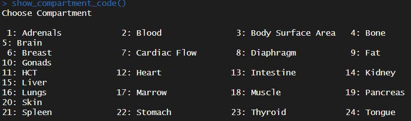
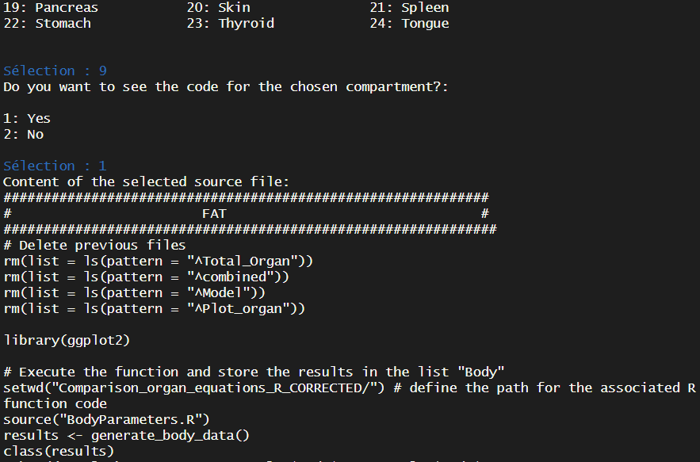

# Lifetime physiological models

Under the scope of the following paper: Gastellu et al. 2024. A Comprehensive Library of Lifetime Physiological Equations for PBK Models: Enhancing Dietary Exposure Modelling with Mercury as Case Study.

In the present repository, the R codes are provided to implement the real-life volume growths of organs over a lifetime in an age-specific PBK model.

Briefly, we collected published physiological equations describing the growth of major human organs over life. We thereafter constructed a library of those equations for both genders and established novel tools in Excel and R that enable easy access and applicability of the physiological equations to be implemented in the next-generation PBK models.

## Structure of the R project

This R project is constructed as follows:

-   a **readme file** to use the different R codes and provide explanations of their contents;
-   a **R script** *`Sources_File_Growth_Curves.R`* which provides the possibility to select the compartment of interest and to directly acces to the physiological equations;
-   a **text file** *`selected_compartment.txt`* which indicates the selected compartment in the R script *`Sources_File_Growth_Curves.R`*
-   a **folder** *`Comparison_organ_equations_R_CORRECTED`* which contains different R files:
    -   the **R codes** for each compartment, n=21 (*`Adrenals.R`*, *`Blood.R`*, *`Bone.R`*, *`Brain.R`*, *`Breast.R`*, *`Diaphragm.R`*, *`Fat.R`*, *`Gonads.R`*, *`Heart.R`*, *`Intestine.R`*, *`Kidney.R`*, *`Liver.R`*, *`Lungs.R`*, *`Marrow.R`*, *`Muscle.R`*, *`Pancreas.R`*, *`Skin.R`*, *`Spleen.R`*, *`Stomach.R`*, *`Thyroid.R`*, *`Tongue.R`* )
    -   the **R codes** for additional physiological parameters (*`Body_surface_area.R`*, *`Cardiac_output.R`*, *`HCT.R`*)
    -   a **R code** for the different functions used in the R codes *`Functions.R`*
    -   an **R code** for generating outputs of growth (body weight, height) of a population (French population in this case) *`BodyParameters.R`*
    -   an **R code** to run multiple physiological models *`Multiple_models.R`*
-   a **folder** *`R_simulations`* which contains different files to reproduce the simulations;
-   a **folder** *`Results_Hg_model_selection`* which contains different files to reproduce the Hg PBK model outputs:

Structure of the current R project.

```{r, echo = FALSE}
library(fs)
tmp_dir <- getwd()
# # Create directory tree
# fs::dir_tree(path = tmp_dir, recurse = TRUE)
# Capture the output of dir_tree
output <- capture.output(dir_tree(path = tmp_dir, recurse = TRUE))
# Remove the first line
output <- output[-1]
# Print the modified output
cat(output, sep = "\n")
```

# Physiological PBK model equations

## How to use it?

Nowadays, the PBK models available in the literature are most often developed for a specific age or specific population. With this repository, we aim to extend the existing PBK models to additional life stages by providing the growth equations depending on the compartment considered in the already existing PBK model.

### Different equations from different models

Different models are implemented in the R codes, depending on the compartment selected.

-   Model_1 = "Beaudouin et al. (2010)"

-   Model_2 = "Haddad et al. (2001)"

-   Model_3 = "Price K. et al. (2003)" \# just for males

-   Model_4 = "Smith et al. (2014)"

-   Model_5 = "Ring et al. (2017)"

-   Model_6 = "Pendse et al. (2020)"

-   Model_7 = "Mallick et al (2020)"

-   Model_8 = "Sarigiannis et al. (2020)"

-   Model_9 = "Wu et al. 2015" \# just for females

-   Model_10 = "Deepika et al (2021)"

-   Model_11 = "Verner et al. (2008)" \# just for females

-   Model_12 = "Haddad et al. (2006)"

### R codes for each compartment

These codes are established in the same way:

1.  Executing a function that creates lifetime outputs for a population (French population here) and storing the results in an R list called *'`Body`' (function:* `generate_body_data()` from the R script *`BodyParameters.R`*
2.  Summary of available male-specific physiological equations
3.  Summary of available female-specific physiological equations
4.  Code section for combining the outputs
5.  Code section for gender-specific figures

#### Example

If a user wants to obtain the evolution over time of the fat volume for females, he can use the specific compartment R code: *`/Comparison_organ_equations_R_CORRECTED/Fat.R`\
*Here, 9 models to describe the fat volume growth are available. In the following R code, 7 models could be used regarding the female-specific equations.

```{r 1, include = TRUE, warning = FALSE, message = FALSE}

#############################################################
#                        FAT                                #
##############################################################
# Delete previous files
rm(list = ls(pattern = "^Total_Organ"))
rm(list = ls(pattern = "^combined"))
rm(list = ls(pattern = "^Model"))
rm(list = ls(pattern = "^Plot_organ"))

library(ggplot2)
library(plotly)

# Execute the function and store the results in the list "Body"
setwd("Comparison_organ_equations_R_CORRECTED/") # define the path for the associated R function code 
source("BodyParameters.R")
results <- generate_body_data()
class(results)
# head(results) # structure: results$Body$M or results$Body$F

Body <- results$Body # list of 2 elements: [1]M for male, [2]F for female
# str(Body)

##############################################################
# 1. List of models
##############################################################

List_of_Models <- list(
  # Model_1 = "Beaudouin et al. (2010)",
  Model_2 = "Haddad et al. (2001)",
  Model_3 = "Price K. et al. (2003)", # just for males
  Model_4 = "Smith et al. (2014)",
  # Model_5 = "Ring et al. (2017)",
  Model_6 = "Pendse et al. (2020)",
  Model_7 = "Mallick et al (2020)",
  Model_8 = "Sarigiannis et al. (2020)",
  Model_9 = "Wu et al. 2015", # just for females
  Model_10 = "Deepika et al (2021)",
  # Model_11 = "Verner et al. (2008)",# just for females
  Model_12 = "Haddad et al. (2006)"
)

##############################################################
# 2a. male-specific physiological equations for models
##############################################################
## Haddad et al. (2001)
Model_2 <- ifelse(Body[["M"]][["age_y"]] < 17,
  (0.0165 * Body[["M"]][["age_y"]]**5 -
    1.9784 * Body[["M"]][["age_y"]]**4 +
    51.963 * Body[["M"]][["age_y"]]**3 -
    459.39 * Body[["M"]][["age_y"]]**2 +
    1566.8 * Body[["M"]][["age_y"]] + 1004.2) / 916,
  (0.0164 * 17**5 -
    1.9784 * 17**4 +
    51.963 * 17**3 -
    459.39 * 17**2 +
    1566.8 * 17 + 1004.2) / 916
)

### Price K. et al. (2003)
Model_3 <- ifelse(Body[["M"]][["age_y"]] < 18,
  (0.0165 * Body[["M"]][["age_y"]]**5 -
    1.9784 * Body[["M"]][["age_y"]]**4 +
    51.963 * Body[["M"]][["age_y"]]**3 -
    459.38 * Body[["M"]][["age_y"]]**2 +
    1566.8 * Body[["M"]][["age_y"]] + 1004.2) / 1000,
  (0.0165 * 18**5 - 1.9784 * 18**4 + 51.963 * 18**3 - 459.38 * 18**2 + 1566.8 * 18 + 1004.2) / 1000
)


### Smith et al. (2014)
Model_4 <- (3.484e-02 + 2.803e-05 * (Body[["M"]][["BW"]] * 1000) -
  1.422e-09 * (Body[["M"]][["BW"]] * 1000)^2 +
  2.892e-14 * (Body[["M"]][["BW"]] * 1000)^3 -
  2.718e-19 * (Body[["M"]][["BW"]] * 1000)^4 +
  1.203e-24 * (Body[["M"]][["BW"]] * 1000)^5 -
  2.036e-30 * (Body[["M"]][["BW"]] * 1000)^6) * Body[["M"]][["BW"]]

#### Pendse et al. 2020
Model_6 <- ifelse(Body[["M"]][["age_y"]] < 20,
  ((2.8975 * exp(-0.129 * Body[["M"]][["age_y"]]) + 0.67) * Body[["M"]][["BMI"]] + 0.2635 * Body[["M"]][["age_y"]] - 4.843) * Body[["M"]][["BW"]] / 100,
  ((-5.33798 * Body[["M"]][["BMI"]] + 0.11149 * (Body[["M"]][["BMI"]]^2) + 0.09795 * Body[["M"]][["age_y"]] + 85.24521) * Body[["M"]][["BW"]]) / 100
)

### Mallick et al. (2020)
Model_7 <- ifelse(Body[["M"]][["age_y"]] < 25,
  ((1.4471 * exp(-0.0761 * Body[["M"]][["age_y"]]) + 0.52) * Body[["M"]][["BMI"]] - 0.10124 * Body[["M"]][["age_y"]] + 5.0465) * Body[["M"]][["BW"]] / 100,
  ((-6.0487 * Body[["M"]][["BMI"]] + 0.1177 * Body[["M"]][["BMI"]]^2 + 0.03155 * Body[["M"]][["age_y"]] + 97.2025) * 0.979) * Body[["M"]][["BW"]] / 100
)

### Sarigiannis et al. (2020)
Model_8 <- ifelse(Body[["M"]][["age_y"]] < 18,
  (2.54e-02 * Body[["M"]][["age_h"]]**1 + 1.88e+01 * (Body[["M"]][["age_h"]]**(5.20e-01)) + 9.06e+02) / 1000,
  (2.54e-02 * (18 * 365 * 24)**1 + 1.88e+01 * ((18 * 365 * 24)**(5.20e-01)) + 9.06e+02) / 1000
)

### Wu et al. (2015)
Model_9 <- "NA"

### Deepika et al. (2021)
Model_10 <- 1.3054356 + 0.3622685 * Body[["M"]][["age_y"]] - 0.0025165 * (Body[["M"]][["age_y"]]**2) + 0.0906119 * Body[["M"]][["BW"]] + 0.0001731 * (Body[["M"]][["BW"]]**2)


Model_List_M <- cbind.data.frame(Model_2, Model_3, Model_4, Model_6, Model_7, Model_8, Model_9, Model_10)
Body[["M"]]$Fat <- Model_List_M

head(Body$M)

head(Body$M$Fat)
##############################################################
# 2b. female-specific physiological equations for models
##############################################################


### Haddad et al. (2001)
Model_2 <- ifelse(Body[["F"]][["age_y"]] < 18,
  (0.038 * Body[["F"]][["age_y"]]**5 -
    2.6629 * Body[["F"]][["age_y"]]**4 +
    60.433 * Body[["F"]][["age_y"]]**3 -
    479.37 * Body[["F"]][["age_y"]]**2 +
    1592.3 * Body[["F"]][["age_y"]] + 912.36) / 916,
  (0.038 * 18**5 - 2.6629 * 18**4 + 60.433 * 18**3 - 479.37 * 18**2 + 1592.3 * 18 + 912.36) / 916
)

### Price K. et al. (2003) - spaceholder
Model_3 <- "NA"

### Smith et al. (2014)
Model_4 <- (9.217e-02 + 1.401e-05 * (Body[["F"]][["BW"]] * 1000) -
  6.787e-10 * (Body[["F"]][["BW"]] * 1000)^2 +
  1.540e-14 * (Body[["F"]][["BW"]] * 1000)^3 -
  1.558e-19 * (Body[["F"]][["BW"]] * 1000)^4 +
  7.249e-25 * (Body[["F"]][["BW"]] * 1000)^5 -
  1.274e-30 * (Body[["F"]][["BW"]] * 1000)^6) * Body[["F"]][["BW"]]

### Pendse et al. (2020)
Model_6 <- ifelse(Body[["F"]][["age_y"]] < 25,
  ((1.5334 * exp(-0.103 * Body[["F"]][["age_y"]]) + 0.67) * Body[["F"]][["BMI"]] + 0.6276 * Body[["F"]][["age_y"]] + 1.0301) * Body[["F"]][["BW"]] / 100,
  ((1.9224 * Body[["F"]][["BMI"]] - 0.018517 * Body[["F"]][["BMI"]]^2 + 0.05537 * Body[["F"]][["age_y"]] - 0.794894)) * Body[["F"]][["BW"]] / 100
)

### Mallick et al. (2020)
Model_7 <- ifelse(Body[["F"]][["age_y"]] < 25,
  ((1.5334 * exp(-0.103 * Body[["F"]][["age_y"]]) + 0.67) * Body[["F"]][["BMI"]] + 0.6276 * Body[["F"]][["age_y"]] + 1.0301) * Body[["F"]][["BW"]] / 100,
  ((1.9224 * Body[["F"]][["BMI"]] - 0.018517 * Body[["F"]][["BMI"]]^2 + 0.05537 * Body[["F"]][["age_y"]] - 0.794895) * 0.979) * Body[["F"]][["BMI"]] / 100
)

### Sarigiannis et al. (2020)
Model_8 <- ifelse(Body[["F"]][["age_y"]] < 18,
  (2.54e-02 * Body[["F"]][["age_h"]]**1 + 1.88e+01 * (Body[["F"]][["age_h"]]**(5.20e-01)) + 9.06e+02) / 1000,
  (2.54e-02 * (18 * 365 * 24)**1 + 1.88e+01 * ((18 * 365 * 24)**(5.20e-01)) + 9.06e+02) / 1000
)

### Wu et al. (2015)
Model_9 <- ifelse(Body[["F"]][["age_y"]] <= 25,
  ((1.5334 * exp(-0.103 * Body[["F"]][["age_y"]])
    + 0.67) * Body[["F"]][["BMI"]] +
    0.6276 * Body[["F"]][["age_y"]] + 1.0301) * Body[["F"]][["BW"]] / 100,
  (1.9224 * Body[["F"]][["BMi"]] -
    0.018517 * Body[["F"]][["BMI"]]^2 +
    0.05537 * Body[["F"]][["age_y"]] -
    0.794894) * Body[["F"]][["BW"]] / 100
)

### Deepika et al. (2021)
Model_10 <- 6.132e-01 + 8.475e-02 * Body[["F"]][["age_y"]] + 8.151e-05 * Body[["F"]][["age_y"]]**2 + 1.341e-01 * Body[["F"]][["BW"]] + 2.297e-03 * (Body[["F"]][["BW"]]**2)


# Combine the output 
Model_List_F <- cbind.data.frame(Model_2, Model_3, Model_4, Model_6, Model_7, Model_8, Model_9, Model_10)
Body[["F"]]$Fat <- Model_List_F


##############################################################
# 3. Gender-specific plotting
##############################################################

# for male
Body_M <- Body[["M"]]

Body_M[12] <- unlist(Body[["M"]][["Fat"]][["Model_2"]])
Body_M[13] <- unlist(Body[["M"]][["Fat"]][["Model_3"]])
Body_M[14] <- unlist(Body[["M"]][["Fat"]][["Model_4"]])
Body_M[15] <- unlist(Body[["M"]][["Fat"]][["Model_6"]])
Body_M[16] <- unlist(Body[["M"]][["Fat"]][["Model_7"]])
Body_M[17] <- unlist(Body[["M"]][["Fat"]][["Model_8"]])
Body_M[18] <- unlist(Body[["M"]][["Fat"]][["Model_9"]])
Body_M[19] <- unlist(Body[["M"]][["Fat"]][["Model_10"]])
Body_M[["Gender"]] <- "Male"

combined_models_M <- rbind(
  data.frame(Body_M, Model = "Model_2", "Volume (in L)" = Body_M[[12]]),
  data.frame(Body_M, Model = "Model_3", "Volume (in L)" = Body_M[[13]]),
  data.frame(Body_M, Model = "Model_4", "Volume (in L)" = Body_M[[14]]),
  data.frame(Body_M, Model = "Model_6", "Volume (in L)" = Body_M[[15]]),
  data.frame(Body_M, Model = "Model_7", "Volume (in L)" = Body_M[[16]]),
  data.frame(Body_M, Model = "Model_8", "Volume (in L)" = Body_M[[17]]),
  data.frame(Body_M, Model = "Model_9", "Volume (in L)" = Body_M[[18]]),
  data.frame(Body_M, Model = "Model_10", "Volume (in L)" = Body_M[[19]])
)

# For female
Body_F <- Body[["F"]]
Body_F[12] <- unlist(Body[["F"]][["Fat"]][["Model_2"]])
Body_F[13] <- unlist(Body[["F"]][["Fat"]][["Model_3"]])
Body_F[14] <- unlist(Body[["F"]][["Fat"]][["Model_4"]])
Body_F[15] <- unlist(Body[["F"]][["Fat"]][["Model_6"]])
Body_F[16] <- unlist(Body[["F"]][["Fat"]][["Model_7"]])
Body_F[17] <- unlist(Body[["F"]][["Fat"]][["Model_8"]])
Body_F[18] <- unlist(Body[["F"]][["Fat"]][["Model_9"]])
Body_F[19] <- unlist(Body[["F"]][["Fat"]][["Model_10"]])
Body_F[["Gender"]] <- "Female"

combined_models_F <- rbind(
  data.frame(Body_F, Model = "Model_2", "Volume (in L)" = Body_F[[12]]),
  data.frame(Body_F, Model = "Model_3", "Volume (in L)" = Body_F[[13]]),
  data.frame(Body_F, Model = "Model_4", "Volume (in L)" = Body_F[[14]]),
  data.frame(Body_F, Model = "Model_6", "Volume (in L)" = Body_F[[15]]),
  data.frame(Body_F, Model = "Model_7", "Volume (in L)" = Body_F[[16]]),
  data.frame(Body_F, Model = "Model_8", "Volume (in L)" = Body_F[[17]]),
  data.frame(Body_F, Model = "Model_9", "Volume (in L)" = Body_F[[18]]),
  data.frame(Body_F, Model = "Model_10", "Volume (in L)" = Body_F[[19]])
)

# Combine male and female outuputs 
Total_Organ <- rbind(combined_models_F, combined_models_M)

Total_Organ <- Total_Organ[, c(-12, -13, -14, -15, -16, -17, -18, -19)]
colnames(Total_Organ)[14] <- "Volume (in L)"

Total_Organ <- transform(Total_Organ, `Volume (in L)` = as.numeric(`Volume (in L)`))
colnames(Total_Organ)[1] <- "Age (in years)"
colnames(Total_Organ)[2] <- "Age (in months)"
colnames(Total_Organ)[3] <- "Age (in hours)"
colnames(Total_Organ)[14] <- "Volume (in L)"
str(Total_Organ)

# Create a named vector for the labels
model_labels <- c( # "Model_1" = "Beaudouin et al. (2010)",
  "Model_2" = "Haddad et al. (2001)",
  "Model_3" = "Price K. et al. (2003)", # just for males
  "Model_4" = "Smith et al. (2014)",
  # "Model_5" = "Ring et al. (2017)",
  "Model_6" = "Pendse et al. (2020)",
  "Model_7" = "Mallick et al (2020)",
  "Model_8" = "Sarigiannis et al. (2020)",
  "Model_9" = "Wu et al. (2015)", # just for females
  "Model_10" = "Deepika et al (2021)",
  # "Model_11" = "Verner et al. (2008)",# just for females
  "Model_12" = "Haddad et al. (2006)"
)

myColors <- c("#999999", "#E69F00", "#56B4E9", "#000000", "#009E73", "#c00000", "#F0E442", "#0072B2", "#D55E00", "#CC79A7", "#37004D", "#BA4881")


# plot the outputs
Plot_organ <- ggplot(data = (Total_Organ), aes(x = `Age (in years)`, y = `Volume (in L)`, color = Model)) +
  geom_line(linewidth = 1.5) +
  scale_color_manual(values = myColors, labels = model_labels)
# scale_linetype_manual(values = c("solid", "dashed"), labels = model_labels)

Plot_organ <- Plot_organ +
  ggtitle("Fat") +
  theme_bw() +
  theme(
    plot.title = element_text(face = "bold", size = 12),
    axis.title.y = element_text(lineheight = 1.5, size = 14),
    axis.title.x = element_text(lineheight = 1.5, size = 14),
    axis.text.y = element_text(lineheight = 1.5, size = 14, margin = margin(r = 6), vjust = 1),
    axis.text.x = element_text(lineheight = 1.5, size = 14),
    legend.text = element_text(lineheight = 1.5, size = 14),
    legend.title = element_text(lineheight = 1.5, size = 14),
    legend.background = element_rect(
      fill = "white",
      linewidth = 4,
      colour = "white"
    ),
    axis.ticks = element_line(colour = "grey70", linewidth = 0.2),
    panel.grid.major = element_line(colour = "grey70", linewidth = 0.2),
    panel.grid.minor = element_blank()
  )

Plot_organ <- Plot_organ +
  facet_wrap(facets = ~Gender) +
  theme(strip.text = element_text(size = 15))

ggplotly(Plot_organ)

```

### Global R code

A general R code (*`Source_File_Growth_Curves.R`)* is directly available in the root of the R project to obtain easily the figure depending on the compartment of interest.

#### Example

If a user wants to obtain the evolution over time of the fat volume for females, he can use the global R code: *`Source_File_Growth_Curves.R`\
*In this dynamic R code, the user has to select the compartment of interest. In this example, for the fat compartment, the user needs to indicate the number **9** in the console when running the R code.

```{r 2}
########################################################################
# STEP 0: Load packages
########################################################################
setwd(dirname(rstudioapi::getActiveDocumentContext()$path)) # attribute the working directory at the root of the project
library(ggplot2)
library(reshape2)

########################################################################
# STEP 1: Generating body weight and height based on French population
########################################################################

print("ACTION: Please set the directory path where the R file for the body parameter calculations is set:")
setwd("Comparison_organ_equations_R_CORRECTED/")
source("BodyParameters.R")

# Execute the function and store the results in the list "Body"
results <- generate_body_data() # print a result per day of life
Body <- results$Body
LifeTimeChangesOrgans <- Body

# Print the plots
print(results$BW_plot_M)
print(results$BW_plot_F)
```

```{r 3, include=F, echo=F}
######################################################################################
# STEP 2: Select compartments and extract R code
# <!> dynamic section for the user
# select one by one the compartment (it is not possible to have a multiple selection)
######################################################################################

print("ACTION: Please set the directory path where the R folder for the growth functions are located:")
path <- getwd() # it will be used in the 'functions' R file
print(path)

print("ACTION: Please set the directory path where the R file for the Functions is set:")
path <- getwd() # it will be used in the 'functions' R file
print(path)

```

```{r 4, eval = FALSE}
source("Functions.R")
```

```{r 5, include = FALSE}
# Define the compartments and corresponding source files

compartments <- c("Adrenals", "Blood", "Body Surface Area", "Bone", "Brain", "Breast", "Cardiac Flow", "Diaphragm", "Fat",
                  "Gonads", "HCT", "Heart", "Intestine", "Kidney", "Liver", "Lungs", "Marrow", "Muscle", "Pancreas", "Skin", "Spleen",
                  "Stomach", "Thyroid", "Tongue")

# select the directory to create the functions
setwd("..")
path_project <- getwd()
path <- paste0(path_project, "/Comparison_organ_equations_R_CORRECTED")

links <- list(
  Adrenals = file.path(path, "Adrenals.R"), 
  Blood = file.path(path, "Blood.R"), 
  "Body Surface Area" = file.path(path, "Body_surface_area.R"), 
  Bone = file.path(path, "Bone.R"), 
  Brain = file.path(path, "Brain.R"), 
  Breast = file.path(path, "Breast.R"), 
  "Cardiac Flow" = file.path(path, "Cardiac_output.R"), 
  Diaphgram = file.path(path, "Diaphragm.R"),
  Fat = file.path(path, "Fat.R"),
  Gonads = file.path(path, "Gonads.R"),
  HCT = file.path(path, "HCT.R"), 
  Heart = file.path(path, "Heart.R"),
  Intestine = file.path(path, "Intestine.R"),
  Kidney = file.path(path, "Kidney.R"), 
  Liver = file.path(path, "Liver.R"), 
  Lungs = file.path(path, "Lungs.R"),
  Marrow = file.path(path, "Marrow.R"),
  Muscle = file.path(path, "Muscle.R"),
  Pancreas = file.path(path, "Pancreas.R"), 
  Skin = file.path(path, "Skin.R"), 
  Spleen = file.path(path, "Spleen.R"), 
  Stomach = file.path(path, "Stomach.R"), 
  Thyroid = file.path(path, "Thyroid.R"), 
  Tongue = file.path(path, "Tongue.R") 
)

# Main function to handle the entire process
show_compartment_code <- function() {
  # Function to prompt the user for a yes or no answer
  get_yes_or_no <- function() {
    answers <- c("Yes", "No")
    while (TRUE) {
      selected_answer <- select.list(answers, title = "Do you want to see the code for the chosen compartment?:")
      if (selected_answer %in% c("Yes", "No")) {
        return(selected_answer)
      } else {
        cat("Please select 'Yes' or 'No'.\n")
      }
    }
  }
  
  # Prompt user to select a compartment
  selected_compartment <- select.list(compartments, title = "Choose Compartment")
  
  if (is.null(selected_compartment)) {
    cat("No compartment selected. Exiting...\n")
    return(NULL)
  }
  
  # Save the selected compartment to a file
  writeLines(selected_compartment, con = "selected_compartment.txt")
  
  # Main logic to handle the selected answer
  answer <- get_yes_or_no()
  if (answer == "Yes") {
    selected_source <- links[[selected_compartment]]
    if (!is.null(selected_source)) {
      selected_source_content <- readLines(selected_source)
      cat("Content of the selected source file:\n")
      cat(selected_source_content, sep = "\n")
      return(selected_compartment)  # Return the selected compartment
    } else {
      cat("Invalid compartment selected or source file not found.\n")
      return(NULL)
    }
  } else {
    cat("Exiting...\n")
    return(NULL)
  }
}

# Function to read the selected compartment from file
read_selected_compartment <- function() {
  if (file.exists("selected_compartment.txt")) {
    selected_compartment <- readLines("selected_compartment.txt")
    return(selected_compartment)
  } else {
    cat("No saved compartment found.\n")
    return(NULL)
  }
}
```

```{r 6, eval = FALSE}
# Execute the function
# <!> dynamic section for the user
# <!> select one compartment (not possible to select multiple)
show_compartment_code()

```



Here the user selects the number 9 in the R console. The user can show the associated R code (which directly shows the R code for the fat compartment (\~/Comparison_organ_equations_R_CORRECTED/Fat.R)



```{r 7, message = FALSE, warnings = FALSE, eval = FALSE}
# Memorize selection
saved_compartment <- read_selected_compartment()
if (!is.null(saved_compartment)) {
  cat("Previously selected compartment:", saved_compartment, "\n")
  selected_link <- links[[saved_compartment]]
  cat("Link to the selected source file:", selected_link, "\n")
}

cat("Previously selected compartment:", saved_compartment, "\n")
cat("Link to the selected source file:", selected_link, "\n")
```

```{r 8, include = F}
#############################################################
#                        FAT                                #
##############################################################
# Delete previous files
rm(list = ls(pattern = "^Total_Organ"))
rm(list = ls(pattern = "^combined"))
rm(list = ls(pattern = "^Model"))
rm(list = ls(pattern = "^Plot_organ"))

library(ggplot2)

# Execute the function and store the results in the list "Body"
setwd("Comparison_organ_equations_R_CORRECTED/") # define the path for the associated R function code 
source("BodyParameters.R")
results <- generate_body_data()
Body <- results$Body # list of 2 elements: [1]M for male, [2]F for female

##############################################################
# 1. List of models
##############################################################

List_of_Models <- list(
  # Model_1 = "Beaudouin et al. (2010)",
  Model_2 = "Haddad et al. (2001)",
  Model_3 = "Price K. et al. (2003)", # just for males
  Model_4 = "Smith et al. (2014)",
  # Model_5 = "Ring et al. (2017)",
  Model_6 = "Pendse et al. (2020)",
  Model_7 = "Mallick et al (2020)",
  Model_8 = "Sarigiannis et al. (2020)",
  Model_9 = "Wu et al. 2015", # just for females
  Model_10 = "Deepika et al (2021)",
  # Model_11 = "Verner et al. (2008)",# just for females
  Model_12 = "Haddad et al. (2006)"
)

##############################################################
# 2a. male-specific physiological equations for models
##############################################################
## Haddad et al. (2001)
Model_2 <- ifelse(Body[["M"]][["age_y"]] < 17,
  (0.0165 * Body[["M"]][["age_y"]]**5 -
    1.9784 * Body[["M"]][["age_y"]]**4 +
    51.963 * Body[["M"]][["age_y"]]**3 -
    459.39 * Body[["M"]][["age_y"]]**2 +
    1566.8 * Body[["M"]][["age_y"]] + 1004.2) / 916,
  (0.0164 * 17**5 -
    1.9784 * 17**4 +
    51.963 * 17**3 -
    459.39 * 17**2 +
    1566.8 * 17 + 1004.2) / 916
)

### Price K. et al. (2003)
Model_3 <- ifelse(Body[["M"]][["age_y"]] < 18,
  (0.0165 * Body[["M"]][["age_y"]]**5 -
    1.9784 * Body[["M"]][["age_y"]]**4 +
    51.963 * Body[["M"]][["age_y"]]**3 -
    459.38 * Body[["M"]][["age_y"]]**2 +
    1566.8 * Body[["M"]][["age_y"]] + 1004.2) / 1000,
  (0.0165 * 18**5 - 1.9784 * 18**4 + 51.963 * 18**3 - 459.38 * 18**2 + 1566.8 * 18 + 1004.2) / 1000
)


### Smith et al. (2014)
Model_4 <- (3.484e-02 + 2.803e-05 * (Body[["M"]][["BW"]] * 1000) -
  1.422e-09 * (Body[["M"]][["BW"]] * 1000)^2 +
  2.892e-14 * (Body[["M"]][["BW"]] * 1000)^3 -
  2.718e-19 * (Body[["M"]][["BW"]] * 1000)^4 +
  1.203e-24 * (Body[["M"]][["BW"]] * 1000)^5 -
  2.036e-30 * (Body[["M"]][["BW"]] * 1000)^6) * Body[["M"]][["BW"]]

#### Pendse et al. 2020
Model_6 <- ifelse(Body[["M"]][["age_y"]] < 20,
  ((2.8975 * exp(-0.129 * Body[["M"]][["age_y"]]) + 0.67) * Body[["M"]][["BMI"]] + 0.2635 * Body[["M"]][["age_y"]] - 4.843) * Body[["M"]][["BW"]] / 100,
  ((-5.33798 * Body[["M"]][["BMI"]] + 0.11149 * (Body[["M"]][["BMI"]]^2) + 0.09795 * Body[["M"]][["age_y"]] + 85.24521) * Body[["M"]][["BW"]]) / 100
)

### Mallick et al. (2020)
Model_7 <- ifelse(Body[["M"]][["age_y"]] < 25,
  ((1.4471 * exp(-0.0761 * Body[["M"]][["age_y"]]) + 0.52) * Body[["M"]][["BMI"]] - 0.10124 * Body[["M"]][["age_y"]] + 5.0465) * Body[["M"]][["BW"]] / 100,
  ((-6.0487 * Body[["M"]][["BMI"]] + 0.1177 * Body[["M"]][["BMI"]]^2 + 0.03155 * Body[["M"]][["age_y"]] + 97.2025) * 0.979) * Body[["M"]][["BW"]] / 100
)

### Sarigiannis et al. (2020)
Model_8 <- ifelse(Body[["M"]][["age_y"]] < 18,
  (2.54e-02 * Body[["M"]][["age_h"]]**1 + 1.88e+01 * (Body[["M"]][["age_h"]]**(5.20e-01)) + 9.06e+02) / 1000,
  (2.54e-02 * (18 * 365 * 24)**1 + 1.88e+01 * ((18 * 365 * 24)**(5.20e-01)) + 9.06e+02) / 1000
)

### Wu et al. (2015)
Model_9 <- "NA"

### Deepika et al. (2021)
Model_10 <- 1.3054356 + 0.3622685 * Body[["M"]][["age_y"]] - 0.0025165 * (Body[["M"]][["age_y"]]**2) + 0.0906119 * Body[["M"]][["BW"]] + 0.0001731 * (Body[["M"]][["BW"]]**2)


Model_List_M <- cbind.data.frame(Model_2, Model_3, Model_4, Model_6, Model_7, Model_8, Model_9, Model_10)
Body[["M"]]$Fat <- Model_List_M

##############################################################
# 2b. female-specific physiological equations for models
##############################################################


### Haddad et al. (2001)
Model_2 <- ifelse(Body[["F"]][["age_y"]] < 18,
  (0.038 * Body[["F"]][["age_y"]]**5 -
    2.6629 * Body[["F"]][["age_y"]]**4 +
    60.433 * Body[["F"]][["age_y"]]**3 -
    479.37 * Body[["F"]][["age_y"]]**2 +
    1592.3 * Body[["F"]][["age_y"]] + 912.36) / 916,
  (0.038 * 18**5 - 2.6629 * 18**4 + 60.433 * 18**3 - 479.37 * 18**2 + 1592.3 * 18 + 912.36) / 916
)

### Price K. et al. (2003) - spaceholder
Model_3 <- "NA"

### Smith et al. (2014)
Model_4 <- (9.217e-02 + 1.401e-05 * (Body[["F"]][["BW"]] * 1000) -
  6.787e-10 * (Body[["F"]][["BW"]] * 1000)^2 +
  1.540e-14 * (Body[["F"]][["BW"]] * 1000)^3 -
  1.558e-19 * (Body[["F"]][["BW"]] * 1000)^4 +
  7.249e-25 * (Body[["F"]][["BW"]] * 1000)^5 -
  1.274e-30 * (Body[["F"]][["BW"]] * 1000)^6) * Body[["F"]][["BW"]]

### Pendse et al. (2020)
Model_6 <- ifelse(Body[["F"]][["age_y"]] < 25,
  ((1.5334 * exp(-0.103 * Body[["F"]][["age_y"]]) + 0.67) * Body[["F"]][["BMI"]] + 0.6276 * Body[["F"]][["age_y"]] + 1.0301) * Body[["F"]][["BW"]] / 100,
  ((1.9224 * Body[["F"]][["BMI"]] - 0.018517 * Body[["F"]][["BMI"]]^2 + 0.05537 * Body[["F"]][["age_y"]] - 0.794894)) * Body[["F"]][["BW"]] / 100
)

### Mallick et al. (2020)
Model_7 <- ifelse(Body[["F"]][["age_y"]] < 25,
  ((1.5334 * exp(-0.103 * Body[["F"]][["age_y"]]) + 0.67) * Body[["F"]][["BMI"]] + 0.6276 * Body[["F"]][["age_y"]] + 1.0301) * Body[["F"]][["BW"]] / 100,
  ((1.9224 * Body[["F"]][["BMI"]] - 0.018517 * Body[["F"]][["BMI"]]^2 + 0.05537 * Body[["F"]][["age_y"]] - 0.794895) * 0.979) * Body[["F"]][["BMI"]] / 100
)

### Sarigiannis et al. (2020)
Model_8 <- ifelse(Body[["F"]][["age_y"]] < 18,
  (2.54e-02 * Body[["F"]][["age_h"]]**1 + 1.88e+01 * (Body[["F"]][["age_h"]]**(5.20e-01)) + 9.06e+02) / 1000,
  (2.54e-02 * (18 * 365 * 24)**1 + 1.88e+01 * ((18 * 365 * 24)**(5.20e-01)) + 9.06e+02) / 1000
)

### Wu et al. (2015)
Model_9 <- ifelse(Body[["F"]][["age_y"]] <= 25,
  ((1.5334 * exp(-0.103 * Body[["F"]][["age_y"]])
    + 0.67) * Body[["F"]][["BMI"]] +
    0.6276 * Body[["F"]][["age_y"]] + 1.0301) * Body[["F"]][["BW"]] / 100,
  (1.9224 * Body[["F"]][["BMi"]] -
    0.018517 * Body[["F"]][["BMI"]]^2 +
    0.05537 * Body[["F"]][["age_y"]] -
    0.794894) * Body[["F"]][["BW"]] / 100
)

### Deepika et al. (2021)
Model_10 <- 6.132e-01 + 8.475e-02 * Body[["F"]][["age_y"]] + 8.151e-05 * Body[["F"]][["age_y"]]**2 + 1.341e-01 * Body[["F"]][["BW"]] + 2.297e-03 * (Body[["F"]][["BW"]]**2)


# Combine the output 
Model_List_F <- cbind.data.frame(Model_2, Model_3, Model_4, Model_6, Model_7, Model_8, Model_9, Model_10)
Body[["F"]]$Fat <- Model_List_F


##############################################################
# 3. Gender-specific plotting
##############################################################

# for male
Body_M <- Body[["M"]]

Body_M[12] <- unlist(Body[["M"]][["Fat"]][["Model_2"]])
Body_M[13] <- unlist(Body[["M"]][["Fat"]][["Model_3"]])
Body_M[14] <- unlist(Body[["M"]][["Fat"]][["Model_4"]])
Body_M[15] <- unlist(Body[["M"]][["Fat"]][["Model_6"]])
Body_M[16] <- unlist(Body[["M"]][["Fat"]][["Model_7"]])
Body_M[17] <- unlist(Body[["M"]][["Fat"]][["Model_8"]])
Body_M[18] <- unlist(Body[["M"]][["Fat"]][["Model_9"]])
Body_M[19] <- unlist(Body[["M"]][["Fat"]][["Model_10"]])
Body_M[["Gender"]] <- "Male"

combined_models_M <- rbind(
  data.frame(Body_M, Model = "Model_2", "Volume (in L)" = Body_M[[12]]),
  data.frame(Body_M, Model = "Model_3", "Volume (in L)" = Body_M[[13]]),
  data.frame(Body_M, Model = "Model_4", "Volume (in L)" = Body_M[[14]]),
  data.frame(Body_M, Model = "Model_6", "Volume (in L)" = Body_M[[15]]),
  data.frame(Body_M, Model = "Model_7", "Volume (in L)" = Body_M[[16]]),
  data.frame(Body_M, Model = "Model_8", "Volume (in L)" = Body_M[[17]]),
  data.frame(Body_M, Model = "Model_9", "Volume (in L)" = Body_M[[18]]),
  data.frame(Body_M, Model = "Model_10", "Volume (in L)" = Body_M[[19]])
)

# For female
Body_F <- Body[["F"]]
Body_F[12] <- unlist(Body[["F"]][["Fat"]][["Model_2"]])
Body_F[13] <- unlist(Body[["F"]][["Fat"]][["Model_3"]])
Body_F[14] <- unlist(Body[["F"]][["Fat"]][["Model_4"]])
Body_F[15] <- unlist(Body[["F"]][["Fat"]][["Model_6"]])
Body_F[16] <- unlist(Body[["F"]][["Fat"]][["Model_7"]])
Body_F[17] <- unlist(Body[["F"]][["Fat"]][["Model_8"]])
Body_F[18] <- unlist(Body[["F"]][["Fat"]][["Model_9"]])
Body_F[19] <- unlist(Body[["F"]][["Fat"]][["Model_10"]])
Body_F[["Gender"]] <- "Female"

combined_models_F <- rbind(
  data.frame(Body_F, Model = "Model_2", "Volume (in L)" = Body_F[[12]]),
  data.frame(Body_F, Model = "Model_3", "Volume (in L)" = Body_F[[13]]),
  data.frame(Body_F, Model = "Model_4", "Volume (in L)" = Body_F[[14]]),
  data.frame(Body_F, Model = "Model_6", "Volume (in L)" = Body_F[[15]]),
  data.frame(Body_F, Model = "Model_7", "Volume (in L)" = Body_F[[16]]),
  data.frame(Body_F, Model = "Model_8", "Volume (in L)" = Body_F[[17]]),
  data.frame(Body_F, Model = "Model_9", "Volume (in L)" = Body_F[[18]]),
  data.frame(Body_F, Model = "Model_10", "Volume (in L)" = Body_F[[19]])
)

# Combine male and female outuputs 
Total_Organ <- rbind(combined_models_F, combined_models_M)

Total_Organ <- Total_Organ[, c(-12, -13, -14, -15, -16, -17, -18, -19)]
colnames(Total_Organ)[14] <- "Volume (in L)"

Total_Organ <- transform(Total_Organ, `Volume (in L)` = as.numeric(`Volume (in L)`))
colnames(Total_Organ)[1] <- "Age (in years)"
colnames(Total_Organ)[2] <- "Age (in months)"
colnames(Total_Organ)[3] <- "Age (in hours)"
colnames(Total_Organ)[14] <- "Volume (in L)"
str(Total_Organ)

# Create a named vector for the labels
model_labels <- c( # "Model_1" = "Beaudouin et al. (2010)",
  "Model_2" = "Haddad et al. (2001)",
  "Model_3" = "Price K. et al. (2003)", # just for males
  "Model_4" = "Smith et al. (2014)",
  # "Model_5" = "Ring et al. (2017)",
  "Model_6" = "Pendse et al. (2020)",
  "Model_7" = "Mallick et al (2020)",
  "Model_8" = "Sarigiannis et al. (2020)",
  "Model_9" = "Wu et al. (2015)", # just for females
  "Model_10" = "Deepika et al (2021)",
  # "Model_11" = "Verner et al. (2008)",# just for females
  "Model_12" = "Haddad et al. (2006)"
)

myColors <- c("#999999", "#E69F00", "#56B4E9", "#000000", "#009E73", "#c00000", "#F0E442", "#0072B2", "#D55E00", "#CC79A7", "#37004D", "#BA4881")


# plot the outputs
Plot_organ <- ggplot(data = (Total_Organ), aes(x = `Age (in years)`, y = `Volume (in L)`, color = Model)) +
  geom_line(linewidth = 1.5) +
  scale_color_manual(values = myColors, labels = model_labels)
# scale_linetype_manual(values = c("solid", "dashed"), labels = model_labels)

Plot_organ <- Plot_organ +
  ggtitle("Fat") +
  theme_bw() +
  theme(
    plot.title = element_text(face = "bold", size = 12),
    axis.title.y = element_text(lineheight = 1.5, size = 14),
    axis.title.x = element_text(lineheight = 1.5, size = 14),
    axis.text.y = element_text(lineheight = 1.5, size = 14, margin = margin(r = 6), vjust = 1),
    axis.text.x = element_text(lineheight = 1.5, size = 14),
    legend.text = element_text(lineheight = 1.5, size = 14),
    legend.title = element_text(lineheight = 1.5, size = 14),
    legend.background = element_rect(
      fill = "white",
      linewidth = 4,
      colour = "white"
    ),
    axis.ticks = element_line(colour = "grey70", linewidth = 0.2),
    panel.grid.major = element_line(colour = "grey70", linewidth = 0.2),
    panel.grid.minor = element_blank()
  )

Plot_organ <- Plot_organ +
  facet_wrap(facets = ~Gender) +
  theme(strip.text = element_text(size = 15))


# save changes of volume over age in list
LifeTimeChangesOrgans[["M"]]$Fat <- Body[["M"]]$Fat
LifeTimeChangesOrgans[["F"]]$Fat <- Body[["F"]]$Fat
```

```{r 9, eval = FALSE}
########################################################################
# STEP 3: Calculation of specific organ volumes
########################################################################

# Execute specific R script
source(selected_link)

```

```{r 10}

print(Plot_organ)
print(List_of_Models) # available models for the compartments equations
print(head(Total_Organ))

########################################################################
# STEP 4: List with all needed organs
########################################################################

cat("The following list gives you all organ volume changes over time for the selected compartments")

print(head(LifeTimeChangesOrgans$M))
print(head(LifeTimeChangesOrgans$F))

cat("Go to line 44 if you want to select another compartment")
```

# PBK model for Hg

The associated codes of the PBK model applied to mercury are available in the folder *`Hg_PBK_model`.* Into this folder, an R script *`R_script_TO_RUN`*`.R` is available to directly run the model on simulated exposure trajectories, as mentioned in our paper.

The source code in C++ of the PBK model is in the folder `/Hg_PBK_model/R_simulations/PBK_model/PBK_model_1.cpp`.

The data for the simulated trajectories of exposure are in the folder `/Hg_PBK_model/R_simulations/Trajectories_of_exposure`.

The raw results obtained for this stury are in the Excel file `/Hg_PBK_model/Results_Hg_model_selection/Final_results_detail` .

## References

Beaudouin, R., et al. (2010). "A stochastic whole-body physiologically based pharmacokinetic model to assess the impact of inter-individual variability on tissue dosimetry over the human lifespan." Regulatory Toxicology and Pharmacology 57(1): 103-116.

Haddad, S., et al. (2001). "A PBPK Modeling-Based Approach to Account for Interactions in the Health Risk Assessment of Chemical Mixtures." Toxicological Sciences 63(1): 125-131.

Price, K., et al. (2003). "Physiological Modeling of Age-Specific Changes in the Pharmacokinetics of Organic Chemicals in Children." Journal of Toxicology and Environmental Health, Part A 66(5): 417-433.

Smith, J. N., et al. (2014). "A human life-stage physiologically based pharmacokinetic and pharmacodynamic model for chlorpyrifos: Development and validation." Regulatory Toxicology and Pharmacology 69(3): 580-597.

Ring, C. L., et al. (2017). "Identifying populations sensitive to environmental chemicals by simulating toxicokinetic variability." Environment International 106: 105-118.

Pendse, S. N., et al. (2020). "Population Life-course exposure to health effects model (PLETHEM): An R package for PBPK modeling." Computational Toxicology 13: 100115.

Mallick, P., et al. (2020). "Development and Application of a Life-Stage Physiologically Based Pharmacokinetic (PBPK) Model to the Assessment of Internal Dose of Pyrethroids in Humans." Toxicol Sci 173(1): 86-99.

Sarigiannis, D. Α., et al. (2020). "Development of a generic lifelong physiologically based biokinetic model for exposome studies." Environmental Research 185: 109307.

Wu, H., et al. (2015). "Can the observed association between serum perfluoroalkyl substances and delayed menarche be explained on the basis of puberty-related changes in physiology and pharmacokinetics?" Environment International 82: 61-68.

Deepika, D., et al. (2021). "Risk Assessment of Perfluorooctane Sulfonate (PFOS) using Dynamic Age Dependent Physiologically based Pharmacokinetic Model (PBPK) across Human Lifetime." Environmental Research 199: 111287.

Verner, M.-A., et al. (2008). "Physiologically Based Pharmacokinetic Modeling of Persistent Organic Pollutants for Lifetime Exposure Assessment: A New Tool in Breast Cancer Epidemiologic Studies." Environmental Health Perspectives 116(7): 886-892.

Haddad, S., et al. (2006). "Development of physiologically based toxicokinetic models for improving the human indoor exposure assessment to water contaminants: trichloroethylene and trihalomethanes." Journal of toxicology and environmental health. Part A 69(23): 2095-2136.
